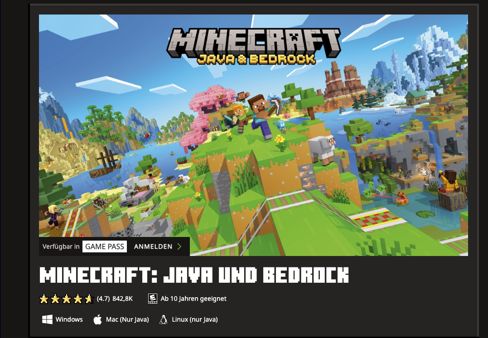

# Minecraft Server
Minecraft Java Edition server running in Docker using a custom Dockerfile and docker-compose setup with persistent world data.
This repository provides a self-built Docker image and docker-compose setup for a Minecraft Java server.
It does NOT use a prebuilt Minecraft Docker image. The official server JAR is downloaded during image build.

## Table of Contents
- [Prerequisites](#prerequisites)
- [Quickstart](#quickstart)
- [Usage](#usage)
- [Configuration](#configuration)
- [Persistence](#persistence)
- [Troubleshooting](#troubleshooting)
- [Security Notes](#security-notes)


## Prerequisites
- Docker
- Docker Compose

## Quickstart

1. Clone repository

```bash
git clone https://github.com/thkbprbxyg-maker/minecraft-server.git
cd minecraft-server
```

2. Create  `.env` file from `example.env` :

```bash
cp example.env .env
```

> [!IMPORTANT]
> You must edit the `.env` file and adjust the values to your own setup.
The `.env` file should not be committed to the repository and may contain sensitive values.


3. Start the server:

```bash
docker compose up --build
```

The Minecraft server will start automatically inside a Docker container.

4. Connect to the server
- Local setup:localhost:25565
- Remote server:<YOUR_SERVER_IP>:25565
(Make sure the port is open in your firewall)

5. Use Minecraft Java Edition to connect.




## Usage

 ## Configuration 

 Environment variables (defaults):
- MC_MEMORY (default: 2G)
- MC_PORT (default: 25565)
- MC_JAR_URL (default: https://launcher.mojang.com/v1/objects/fe3f2e6f1f3b5e3c3c3c3c3c3c3c3c3c3c/server.jar)

 You can change them in docker-compose.yaml:
 Environment:
 MC_MEMORY: "4G"
 MC_PORT: "25565"


## Persistence

All server data (world, configs, etc.) is stored in the Docker volume mc-data, mounted to /minecraft.
This ensures data is not lost after container restarts.

## Troubleshooting

Check logs:

```bash
docker compose logs -f
```

 Rebuild after changing the jar URL:

```bash
docker compose up --build
 ```

 Verify container is runing:

```bash
docker ps
 ```


## Security Notes 

 Do not commit secrets, tokens, passwords, SSH keys, or IP addresse to the repository.
 Use environment variables or .env (ignored by git) if needed


## Build & Run

```bash
docker compose up --build
```

Check availability:

```bash
curl -I http://<your_ip>:8888 || true
```

Minecraft is not an HTTP service, so curl isn't perfect – better:

``` bash
docker compose logs -f
```

Server = Done

Test persistence
 Run the server once (the world will be created)
 Stop:

 ```bash
docker compose down
```
 Start:

 ```bash
docker compose up
```

 Restart-Policy Test
 Server Kill:

 ```bash
docker kill mc-server
```

 ```bash
docker ps
```

 The container should restart automatically (restart: unless-stopped).

